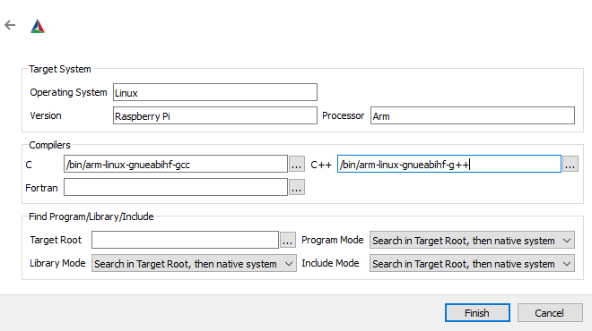

### Introduction

MACHineEMUlator is a project which aims to define a simple framework for creating an emulated machine.

##### Motivation

I needed something simple and extensible to keep myself busy during all the spare time we had during the COVID-19 pandemic
and to allow myself to keep up with the latest c++ standards, learn about cpu emulation (an interest my mine) and to pick up
a bit of Python and other scripting languages where applicable. This is just one of many implementations out there, and while
speed is not a motivating factor behind this project, optimisations will be considered if and when they are needed.

##### Project Goals

This list will expand as certain milestones are achieved.

1. Implement a complete Intel 8080 cpu emulator with passing individual unit tests for each instruction. It should also pass the standard Intel 8080 cpudiag tests which can be found online. **COMPLETE**

2. Implement a simple clock which will control the speed of the cpu and have the ability to have its resolution customised. **COMPLETE**

3. Implement an abstract controller interface which can be used to read and write data. The interface can then be used to create custom memory and io controllers which can be targeted towards specific programs and architectures. **COMPLETE**

4. Implement a basic system bus which can be used as 'lines' of communication between the cpu and various controllers. **COMPLETE**

5. Implement a Zilog Z80 cpu emulator complete with passing additional individual instruction unit tests. It should also pass the standard z80 zexall tests which can be found online. **NOT STARTED**

6. Add a Python module which wraps the emulator C++ shared library complete with unit tests. **COMPLETE**

### Overview

Conceptually speaking, MachEmu can be represented by the following diagram:

As can be seen from the diagram above MachEmu is represented by the inner machine containing a cpu and a clock used to regulate its speed. The speed the clock runs at is dictated by the cpu type, however the resolution of the clock can be externally manipulted, see configuration option `clockResolution`.

The outer machine represents the inner machine customisation. For example, custom input/output may involve interacting with a keyboard or mouse, or some other proprietary peripheral, whereas custom memory maybe as simple as reading and writing to a block of locally allocated memory, a network socket or some other proprietary memory configuration, this all depends on the machine being built, see `IMachine::SetIoControlller` and `IMachine::SetMemoryController`.

Example code in this framework is supplied in the form of unit tests. A test IO contoller library is supplied which gives implementations of both an IO controller and
a memory controller.

The following table displays the current defacto test suites that these unit tests run.

| Cpu   | Test             | Status | 
|:-----:|:----------------:|:------:|
| i8080 | 8080EXM          | PASS   |
|       | 8080PRE          | PASS   |
|       | CPUTEST          | PASS   |
|       | TST8080          | PASS   |

IMachine.h specifies the MachEmu API and outlines the basic principles of operation. 
MachineFactory.h specifies the MachEmu shared library entry point.

### Compilation

The compilation steps below are geard towards installing MachEmu and building the tests from the development package, however, these steps closely align when building the develoment package from source. When you are building from source and want to create a development package you need to run the Sdk project.

##### Pre-requisites

The following development packages require installation:

- [cmake](https://cmake.org/download/) 
- [nlohmann_json](https://github.com/nlohmann/json/releases) 
- [zlib](https://github.com/madler/zlib/releases) (when the development package has been built with the enableZlib cmake config option enabled) 

When the MachEmu development package has been built with the enablePythonModule cmake config option enabled, the following development packages require installtion:

- [Python3](https://www.python.org/downloads/windows/) 
- Python3 development (when building from source) 
    - **Linux:** `sudo apt install python3-dev` 
    - **Windows:** available via the advanced options in the installer. 
- [pybind11](https://github.com/pybind/pybind11) (when building the development package) 
- [numpy](https://github.com/numpy/numpy) (when using the Python example memory controller) 

##### Configuration

Untar the mach-emu archive.

MachEmu uses CMake (3.28 is the minimum version required) for its build system and has been tested on both Window 10 and Ubuntu 23.10.

Open cmake-gui (feel free to use command line cmake, but the remainder of this readme will use cmake-gui). Set the source code text field to the mach-emu directory and the binaries text field to a desired directory for the build files.

Click configure and choose Visual Studio 16 or 17 for Windows or Unix Makefiles for Linux (if prompted to create the build directory, accept), then click generate.

##### Windows

The following image give a possible Windows CMake configuration (note that we don't use gmock and we don't require gtest installation so those options are turned off). Make sure that your install location is in your PATH environment variable otherwise MachEmu.dll will fail to load when the unit tests are run.

.png)

MachEmu has been tested using Microsoft Visual Studio and requires at least version 16 (2019). Open the mach-emu visual studio solution, (depending on your install location you may need to open visual studio with admin privileges) set the configuration to Release and project to INSTALL, then build. Once this builds successfully you will be able to change your project to the machine and controller unit tests and they should run successfully.

##### Linux

The following image gives a possible Linux CMake configuration (note that we don't use gmock and we don't require gtest installation so those options are turned off). Also note that the required CXX compiler needs to be g++ (Clang is currently not supported). If the gui output displays a different compiler you can open the root CMakeLists.txt and uncomment the following line `set(CMAKE_CXX_COMPILER g++-13)`

.png)

MachEmu has been tested with g++ version 13.2 with GNU Make 4.3. Earlier versions of g++ may work though they are untested. Once CMake has finished change into the build directory and run make install. Depending on your install location you may need to run sudo make install. Once it completes the Machine unit tests can be found in Tests/MachineTest and the controller tests in Tests/ControllerTest.

##### Arm Linux

MachEmu can be cross compiled for Arm Linux. It has been tested successfully against Raspberry Pi OS on a Raspberry Pi 5 with gcc-arm-linux-gnueabihf 12.3.

Install the arm compiler: `sudo apt install gcc-arm-linux-gnueabihf`.

Before an Arm cross compile can be started any dependent libraries must be cross compiled for Arm.

**Building zlib** (only required if the enableZlib cmake config option has been enabled)

1. Get the latest zlib from github.
2. Open cmake-gui, set the source code text field to the zlib directory and the binaries text field to a desired directory for the build files, then click configure.
3. Select `Unix Makefiles` for the project generator and check `Specify options for cross-compiling`, click `Next`.
4. Specify the options for the target system. 
 
Note: the Fortran compiler and Find Program/Libraty/Include options remain unchanged. 
5. The following image gives a possible Arm Linux configuration 
.png) 
Note: the CMAKE_INSTALL_PREFIX and other install location prefixes (bin/inc/lib/etc) **must** be set to the CMAKE_FIND_ROOT_PATH directory as set in the Tools/arm-linux-gnueabihf.cmake toolchain file. By default it is set to `${CMAKE_SOURCE_DIR}/Arm` but can be changed to any location of your choosing as long as they both match.
6. Change directory into the binaries directory that was configured in step 2 and run `make install`. This will install zlib into the Arm build environment as specifed in the previous step: `${CMAKE_SOURCE_DIR}/Arm`.

**Building MachEmu**

1. Open cmake-gui, set the source code text field to the mach-emu directory and the binaries text field to a desired directory for the build files, then click configure.
2. Select `Unix Makefiles` for the project generator and check `Specify toolchain file for cross-compiling`, click `Next`.
3. Select the toolchain file located in the tools directory: `arm-linux-gnueabihf.cmake`, click `Finish`. Once it completes click `Generate`.
4. Change into the binaries directory and run `make`.
5. When make completes, run `make Sdk`, this should generate a tar.gz archive with a binary mach-emu arm distribution.
6. Copy the distribution to the arm machine: `scp mach-emu-v1.5.1-Linux-Arm-bin.tar.gz ${user}@raspberrypi:mach-emu-v1.5.1.tar.gz`
7. Ssh into the arm machine: `ssh ${user}@raspberrypi`.
8. Extract the mach-emu archive copied over via scp: `tar -xzf mach-emu-v1.5.1.tar.gz`.
9. Change directory to mach-emu.
10. Install the mach-emu shared library: `./mach-emu-install.sh`. This will install the shared library to /usr/lib
11. Change directory to bin and run the Controller and Machine Tests programs, they should run successfully.

##### Python

When the enablePythonModule option is checked a MachEmu Python module will be built (when building the development package) and installed in the same directory as the MachEmu shared library.

The MachEmu module needs to be in the Python interpreter search path, this can be done via one of the following (amoungst others) methods:

1. Add the MachEmu lib install path to your PYTHONPATH environment variable: 
    `export PYTHONPATH=${mach-emu-install-dir}/lib`
2. At run time via the Python sys module: 
    `sys.path.append(${mach-emu-install-dir}/lib)`

### Configuration Options

A number of configuration options are available that can be used to control the behaviour of the machine. The options must be supplied as a string in json format or the location of the json configuration file preceded with a recognised protocol.

Supported protocols:

| Protocol | Remarks                                   |
|:---------|:------------------------------------------|
| file://  | Load a json file from local disk storage  |

The following table describes the supported options (note, when no option is specifed the one marked as default will be used):

| Option          | Type   | Value	            | Remarks                                                                            |
|:----------------|:-------|:-------------------|:-----------------------------------------------------------------------------------|
| clockResolution | int64  | -1 (default)       | Run the machine as fast as possible with the highest possible resolution           |
|                 |        | 0                  | Run the machine at realtime (or as close to) with the highest possible resolution  |
|                 |        | 0 - 1000000        | Will always spin the cpu to maintain the clock speed and is not recommended        |
|                 |        | n                  | A request in nanoseconds as to how frequently the machine clock will tick          |
| compressor      | string | "zlib" (default)   | Use zlib compression library to compress the ram when saving its state             |
|                 |        | "none"             | No compression will be used when saving the state of the ram                       |
| encoder         | string | "base64" (default) | The binary to text encoder to use when saving the machine state ram to json        |
| cpu             | string | "i8080" (default)  | A machine based on the Intel8080 cpu (can only be set via MachEmu::MakeMachine)    |
| isrFreq         | double | 0 (default)        | Service interrupts at the completion of each instruction                           |
|                 |        | 1                  | Service interrupts after each clock tick                                           |
|                 |        | n                  | Service interrupts frequency, example: 0.5 - twice per clock tick                  |
| loadAsync       | bool   | true               | Run the load initiation handler on a separate thread                               |
|                 |        | false (default)    | Run the load initiation handler from the thread specified by the `runAsync` option |
| ramOffset       | uint16 | n (default: 0)     | The offset in bytes from the start of the memory to the start of the ram           |
| ramSize         | uint16 | n (default: 0)     | The size of the ram in bytes                                                       |
| romOffset		  | uint16 | n (default: 0)     | The offset in bytes from the start of the memory to the start of the rom           |
| romSize         | uint16 | n (default: 0)     | The size of the rom in bytes                                                       |
| runAsync        | bool   | true               | `IMachine::Run` will launch its execution loop on a separate thread                |
|                 |        | false (default)    | `IMachine::Run` will run its execution loop on the current thread                  |
| saveAsync       | bool   | true               | Run the save completion handler on a separate thread                               |
|                 |        | false (default)    | Run the save completion handler from the thread specifed by the `runAsync` option  |

There are two methods of supplying configuration options:

1. Via the `MakeMachine` factory method: 
    C++ - `auto machine = MachEmu::MakeMachine(R"({"cpu":"i8080"})")` 
    Python - `self.machine = MakeMachine(r'{"cpu":"i8080"}')`

2. Via the `IMachine` interface method: 
    C++ - `machine->SetOptions(R"({"isrFreq":1})")` 
    Python - `self.machine.SetOptions(r'{"isrFreq":1.0}')`

See `MachEmu::MakeMachine` and `IMachine::SetOptions` for further details.

### Acknowledgements

Special thanks to the following sites:

- [i8080 Manual](https://altairclone.com/downloads/manuals/8080%20Programmers%20Manual.pdf) 
- [CPU Tests](https://altairclone.com/downloads/cpu_tests/) 
- [Pretty Assmebler](https://caglrc.cc/~svo/i8080/) 
- [Base64 coding](https://github.com/tobiaslocker/base64)
- [MD5 hashing](https://github.com/Zunawe/md5-c)