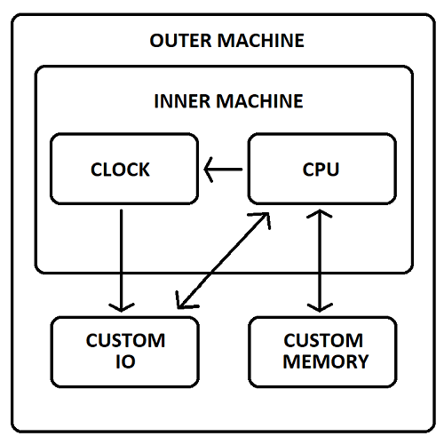

### Introduction

MACHineEMUlator is a project which aims to define a simple framework for creating an emulated machine.

##### Motivation

I needed something simple and extensible to keep myself busy during all the spare time we had during the COVID-19 pandemic
and to allow myself to keep up with the latest c++ standards, learn about cpu emulation (an interest my mine) and to pick up
a bit of Python and other scripting languages where applicable. This is just one of many implementations out there, and while
speed is not a motivating factor behind this project, optimisations will be considered if and when they are needed.

##### Project Goals

This list will expand as certain milestones are achieved.

1. Implement a complete Intel 8080 cpu emulator with passing individual unit tests for each instruction. It should also pass the standard Intel 8080 cpudiag tests which can be found online. **COMPLETE**

2. Implement a simple clock which will control the speed of the cpu and have the ability to have its resolution customised. **COMPLETE**

3. Implement an abstract controller interface which can be used to read and write data. The interface can then be used to create custom memory and io controllers which can be targeted towards specific programs and architectures. **COMPLETE**

4. Implement a basic system bus which can be used as 'lines' of communication between the cpu and various controllers. **COMPLETE**

5. Implement a Zilog Z80 cpu emulator complete with passing additional individual instruction unit tests. It should also pass the standard z80 zexall tests which can be found online. **NOT STARTED**

6. Add a Python module which wraps the emulator C++ shared library complete with unit tests. **COMPLETE**

### Overview

Conceptually speaking, MachEmu can be represented by the following diagram:



As can be seen from the diagram above MachEmu is represented by the inner machine containing a cpu and a clock used to regulate its speed. The speed the clock runs at is dictated by the cpu type, however the resolution of the clock can be externally manipulted, see configuration option `clockResolution`.

The outer machine represents the inner machine customisation. For example, custom input/output may involve interacting with a keyboard or mouse, or some other proprietary peripheral, whereas custom memory maybe as simple as reading and writing to a block of locally allocated memory, a network socket or some other proprietary memory configuration, this all depends on the machine being built, see `IMachine::SetIoControlller` and `IMachine::SetMemoryController`.

Example code in this framework is supplied in the form of unit tests. A test IO contoller library is supplied which gives implementations of both an IO controller and
a memory controller.

The following table displays the current defacto test suites that these unit tests run.

| Cpu   | Test             | Status | 
|:-----:|:----------------:|:------:|
| i8080 | 8080EXM          | PASS   |
|       | 8080PRE          | PASS   |
|       | CPUTEST          | PASS   |
|       | TST8080          | PASS   |

`IMachine.h` specifies the MachEmu API.<br>
`MachineFactory.h` specifies the MachEmu shared library entry point.

##### Basic principles of operation

The following code snippet gives and example of how a machine can be instantiated, configured and executed:

```cpp
// Create a synchronous i8080 machine running as fast as possible 
auto machine = MakeMachine();

// Create a custom memory controller (See tests for examples)
auto customMemoryController = std::make_unique<CustomMemoryController>();

// Load memory with program via custom controller method
customMemoryController->LoadProgram("myProgram.com");

// Create custom IO Controller (See tests for examples)
auto customIOController = std::make_unique<CustomIOController>();

// Set the memory and IO controllers with the machine
machine->SetIOController(customIOController);
machine->SetMemoryController(customMemoryController);

// Can be called from a different thread if the runAsync/loadAsync options are specifed
machine_->OnLoad([]
{
	// Return the json state to load, could be read from disk for example
	return "json state as passed to OnSave";
});

// Can be called from a different thread if the runAsync/saveAsync options are specifed
machine->OnSave([](const char* json)
{
	// Handle the machines current state, for example, writing it to disk
	std::cout << json << std::endl;
});		

// Set the ram/rom sizes (0x2000 and 0x4000) and offsets (0x0000, 0x2000) for this custom memory controller
// These values are used for load and save requests
machine_->SetOptions(R"({"romOffset":0,"romSize":8192,"ramOffset":8192,"ramSize":16384})");

// Set the clock resolution - not setting this will run the
// machine as fast as possible (default)
machine->SetOptions(R"({"clockResolution":20000000})"); // 20 milliseconds (50Hz)

// Run the machine sychronously, it won't return until the custom IO
// controller ServiceInterrupts override generates an ISR::Quit interrupt
auto runTime = machine->Run();

// Run the machine asychronously - this can be done by setting the following json config
// option either in the MakeMachine factory method or via IMachine::SetOptions
machine->SetOptions(R"({"runAsync":true})");
machine->Run();

// ...
// Do additional work here while the machine is running
// ...

// Will not return until the custom IO
// controller ServiceInterrupts override generates an ISR::Quit interrupt
runTime = machine->WaitForCompletion();
```

### Compilation

MachEmu uses CMake (minimum version 3.23) for its build system, Conan (minimum version 2.0) for it's dependency package manager, Python3-dev for python module support, pip for conan installation, cppchek for static analysis and Doxygen for documentation. Supported compilers are GCC (minimum version 12), MSVC(minimum version 16) and Clang (minimum version 16).

#### Pre-requisites

##### Linux

- `sudo apt install cppcheck` (if building a distribution, see step 7).
- `sudo apt install cmake`.
- `sudo apt install doxygen` (if building a distribution, see step 7).
- `sudo apt install python3`.
- `sudo apt install python3-dev` (if building the Python module, see step 4).
- `pipx install conan`.
- `sudo apt install gcc-arm-linux-gnueabihf`. (if cross compiling for Arm, see step 3).

##### Windows

- [CppCheck static analysis](http://cppcheck.net/) (if building a distribution, see step 7).<br>
- [CMake build system](https://cmake.org/download/).<br>
- [Doxygen](https://www.doxygen.nl/download.html) (if building a distribution, see step 7).<br>
- [Python3](https://www.python.org/downloads/windows/).<br>
- `python3-dev`: available via the advanced options in the Python3 installer (if building the Python module, see step 4).
- `pip install conan`.

#### Configuration

**1.** Create a default profile: `conan profile detect`. This will detect the operating system, build architecture, compiler settings and set the build configuration as Release by default. The profile will be named `default` and will reside in $HOME/.conan2/profiles. 

**2.** The created profile is an educated guess, open it and make sure that it is correct for your system, ensure that the compiler standard is set to 20: `compiler.cppstd=20`.

**3.** Run conan to install the dependent packages.
- Using the default build and host profiles: `conan install . --build=missing`.
- Using the default build profile targeting Raspberry Pi: `conan install . --build=missing -pr:h=profiles/raspberry`.<br>
NOTE: when performing a cross compile using a host profile you must install the requisite toolchain of the target architecture (See Pre-requisites).

This will (compile if required and) install the following dependent packages:

- `base64`: for base64 coding.
- `gtest`: for running the machine and controller unit tests.
- `hash-library`: for md5 hashing.
- `nlohmann_json`: for parsing machine configuration options.
- `pybind`: for creating Python C++ bindings.
- `zlib`: for memory (de)compression when loading and saving files.<br>
If you are not interested in building the Python module or zlib support the pybind and zlib packages can be removed from the conanfile.txt `[requires]` section. Make sure to disable zlib support if you remove zlib (see step 4 below).

You can override the default build configuration to Debug (or MinRelSize or RelWithDebInfo) by overriding the build_type setting: `conan install . --build=missing --settings=build_type=Debug`.

You can also compile the dependent zlib library statically if required by overriding the shared option: `conan install . --build=missing --options=zlib/*:shared=False`.

**4.** Run cmake to configure and generate the build system.

- Multi configuration generators (MSVC for example): `cmake --preset conan-default [-Wno-dev]`.
- Single configuration generators (make for example): `cmake --preset conan-release [-Wno-dev]`.<br>
A Debug preset (or MinRelSize or RelWithDebugInfo) can be used if the said build_type was used during the previous step: `cmake --preset conan-debug`.

The following error has been encountered on Linux with conan 2.3.0 and cmake 3.25.1:<br>
`Error in find_package: By not providing "Findgtest.cmake" in CMAKE_MODULE_PATH ...`.<br>
The name of the include is case sensitive, make sure that it is the case:<br>
`mv build/Release/generators/FindGTest.cmake build/Release/generators/Findgtest.cmake`.

The following MachEmu cmake options are supported:
- Disable zlib support: `cmake --preset conan-default -D enableZlib=False`.
- Enable the Python module: `cmake --preset conan-default -D enablePythonModule=True`.

**5.** Run cmake to compile MachEmu: `cmake --build --preset conan-release`.<br>
The presets of `conan-debug`, `conan-minsizerel` and `conan-relwithdebinfo` can also be used as long as they have been configured in the previous steps.

NOTE: when cross compiling the default build directory may need to be removed if any build conflicts occur: `rm -rf build`. Go to Step 3.

**6.** Run the unit tests:

C++ - Windows:
- `artifacts\Release\AMD64\bin\MachineTest.exe`.
- `artifacts\Release\AMD64\bin\ControllerTest.exe`.

C++ - Linux:
- `artifacts/Release/x86_64/bin/MachineTest.exe`.
- `artifacts/Release/x86_64/bin/ControllerTest.exe`.

C++ - Arm Linux:<br>

When running a cross compiled build the binaries need to be uploaded to the host machine before they can be executed.
1. Create an Arm Linux binary distribution: `cmake --build --preset conan-release --target=Sdk`. 
2. Copy the distribution to the arm machine: `scp build/Release/Sdk/mach-emu-v1.5.1-Linux-Arm-bin.tar.gz ${user}@raspberrypi:mach-emu-v1.5.1.tar.gz`.
3. Ssh into the arm machine: `ssh ${user}@raspberrypi`.
4. Extract the mach-emu archive copied over via scp: `tar -xzf mach-emu-v1.5.1.tar.gz`.
5. Change directory to mach-emu: `cd mach-emu`.
6. Install the mach-emu shared library at a specifed location (optional): `./mach-emu-install.sh /usr/local/lib`.
7. Run the unit tests using the test programs: `bin/MachineTest bin/Programs/`.<br>

Python:
- `Tests\MachineTest\source\test_Machine.py -v`.

Note: the `Cpu8080` and `8080Exm` tests will take a while to complete, especially with Python. For the C++ unit tests the command line option --gtest_filter can be used to run a subset of the tests and under Python the -k option can be used for the same effect.
- `artifacts\Release\AMD64\bin\MachineTest.exe --gtest_filter=*Load*`: run the OnLoad unit tests.
- `Tests\MachineTest\source\test_Machine.py -v -k Timed`: run the Timed unit tests.

The location of the test programs directory can be overridden if required: `bin/MachineTest ${test/programs/directory/}`.

**7.** Build a development distribution: `cmake --build --preset conan-release --target=Sdk`.<br>
The distribution will be located in `build/Release/Sdk`.<br>
Note: when cross compiling this command will generate a binary distribution.

### Configuration Options

A number of configuration options are available that can be used to control the behaviour of the machine. The options must be supplied as a string in json format or the location of the json configuration file preceded with a recognised protocol.

Supported protocols:

| Protocol | Remarks                                   |
|:---------|:------------------------------------------|
| file://  | Load a json file from local disk storage  |

The following table describes the supported options (note, when no option is specifed the one marked as default will be used):

| Option          | Type   | Value	            | Remarks                                                                            |
|:----------------|:-------|:-------------------|:-----------------------------------------------------------------------------------|
| clockResolution | int64  | -1 (default)       | Run the machine as fast as possible with the highest possible resolution           |
|                 |        | 0                  | Run the machine at realtime (or as close to) with the highest possible resolution  |
|                 |        | 0 - 1000000        | Will always spin the cpu to maintain the clock speed and is not recommended        |
|                 |        | n                  | A request in nanoseconds as to how frequently the machine clock will tick          |
| compressor      | string | "zlib" (default)   | Use zlib compression library to compress the ram when saving its state             |
|                 |        | "none"             | No compression will be used when saving the state of the ram                       |
| encoder         | string | "base64" (default) | The binary to text encoder to use when saving the machine state ram to json        |
| cpu             | string | "i8080" (default)  | A machine based on the Intel8080 cpu (can only be set via MachEmu::MakeMachine)    |
| isrFreq         | double | 0 (default)        | Service interrupts at the completion of each instruction                           |
|                 |        | 1                  | Service interrupts after each clock tick                                           |
|                 |        | n                  | Service interrupts frequency, example: 0.5 - twice per clock tick                  |
| loadAsync       | bool   | true               | Run the load initiation handler on a separate thread                               |
|                 |        | false (default)    | Run the load initiation handler from the thread specified by the `runAsync` option |
| ramOffset       | uint16 | n (default: 0)     | The offset in bytes from the start of the memory to the start of the ram           |
| ramSize         | uint16 | n (default: 0)     | The size of the ram in bytes                                                       |
| romOffset		  | uint16 | n (default: 0)     | The offset in bytes from the start of the memory to the start of the rom           |
| romSize         | uint16 | n (default: 0)     | The size of the rom in bytes                                                       |
| runAsync        | bool   | true               | `IMachine::Run` will launch its execution loop on a separate thread                |
|                 |        | false (default)    | `IMachine::Run` will run its execution loop on the current thread                  |
| saveAsync       | bool   | true               | Run the save completion handler on a separate thread                               |
|                 |        | false (default)    | Run the save completion handler from the thread specifed by the `runAsync` option  |

There are two methods of supplying configuration options:

1. Via the `MakeMachine` factory method:<br>
    C++ - `auto machine = MachEmu::MakeMachine(R"({"cpu":"i8080"})")`<br>
    Python - `self.machine = MakeMachine(r'{"cpu":"i8080"}')`

2. Via the `IMachine` interface method:<br>
    C++ - `machine->SetOptions(R"({"isrFreq":1})")`<br>
    Python - `self.machine.SetOptions(r'{"isrFreq":1.0}')`

See `MachEmu::MakeMachine` and `IMachine::SetOptions` for further details.

### Acknowledgements

Special thanks to the following sites:

- [i8080 Manual](https://altairclone.com/downloads/manuals/8080%20Programmers%20Manual.pdf)<br>
- [CPU Tests](https://altairclone.com/downloads/cpu_tests/)<br>
- [Pretty Assmebler](https://caglrc.cc/~svo/i8080/)<br>
- [Base64 coding](https://github.com/tobiaslocker/base64)
- [MD5 hashing](https://github.com/Zunawe/md5-c)